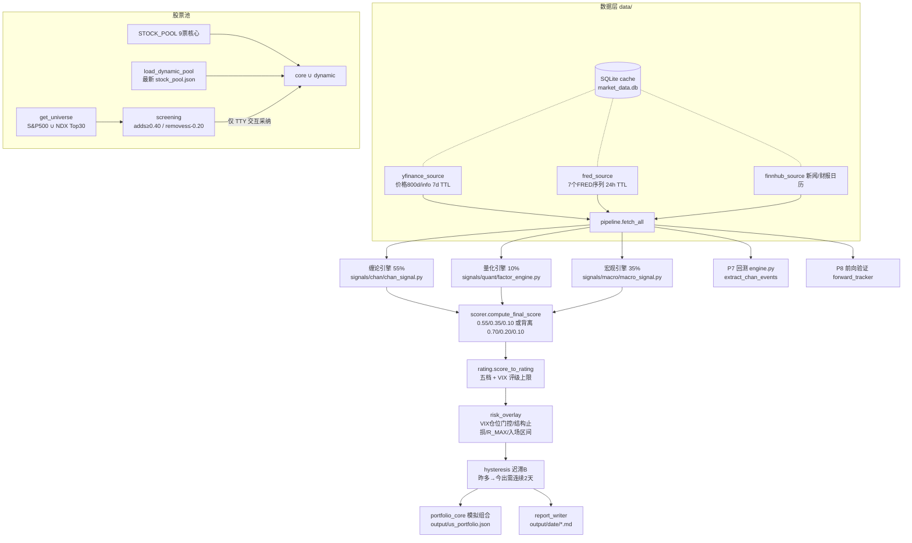

# PRD — 美股量化选股与智能投资系统（缠论 × 宏观 × 量化）

> **Product Requirements Document — US Stock Selection & Intelligent Investment System**
>
> 版本 v1.0 ｜ 撰写日期 2026-07-09 ｜ 基线 commit `7b0c609`
> 本文档基于对全库的完整代码审计（Chan/Quant/Macro 三引擎 + 决策/风控/迟滞/模拟组合/回测全链路逐行核验）撰写。
> 覆盖范围：**仅美股主线（`main.py`）**；A股（`mainA.py`）仅在共用模块受影响时提及。
> **本文档为需求与审计结论，未随附任何源码修改。**

---

## 目录 Table of Contents

1. [概述 Overview](#1-概述-overview)
2. [系统现状架构 Current Architecture](#2-系统现状架构-current-architecture)
3. [审计结论：有效性验证 Audit: Validity Verification](#3-审计结论有效性验证-audit-validity-verification)
4. [缺陷与风险清单 Defects & Risks](#4-缺陷与风险清单-defects--risks)
5. [优化需求 Improvement Requirements](#5-优化需求-improvement-requirements)
6. [非功能需求 Non-Functional Requirements](#6-非功能需求-non-functional-requirements)
7. [验收与回归 Acceptance & Regression](#7-验收与回归-acceptance--regression)
8. [附录 Appendix](#8-附录-appendix)

---

## 1. 概述 Overview

### 1.1 产品定位

本系统是一个**每日运行**的美股量化投研引擎：以缠论结构择时为主轴一（55%）、宏观制度门控为主轴二（35%）、
量化五因子横截面排序为配角（10%），对股票池逐票产出五档评级（Buy/Overweight/Hold/Underweight/Sell）、
建议仓位、结构止损/止盈、入场区间，并驱动一个跨日结转的模拟组合（paper-trading），
最终输出**当日可交易的美股候选清单**（`output/{date}/daily_summary.md` + 分票报告 + `portfolio.md`）。

### 1.2 诚实边界（继承 CLAUDE.md，本 PRD 不做任何 overclaim）

- ✅ 忠实实现：包含关系、顶底分型、笔、中枢(ZG/ZD+延伸)、背驰（**创新极值 + MACD 面积衰竭**双条件）、
  一/二/三类买卖点、分型停顿法、走势类型、R 比率风控、右端三层防护（定笔/迟滞/波动率）。
- ❌ 按数据约束简化（US 只有日线数据，硬约束）：**线段**（以「笔→中枢」近似）、**级别递归/区间套**
  （仅日线单级别 + 周线 SMA 过滤）、一买的次级别背驰确认。
- ⚠️ 近似语义：中枢方向未计算；b2 实为「中枢下沿回踩」启发式。

### 1.3 本次审计的总体结论（TL;DR）

**架构与实现总体忠实于设计文档**：三引擎权重、背离分支、VIX 四档门控、背驰双条件、右端三层防护、
结构止损与 R_MAX 降级均与 CLAUDE.md 一致，历史 `price×(1−VIX%)` 止损坐标 bug 已彻底清除，
实盘路径无前视偏差（现价严格为 t-1 已完成 K 线）。

**但存在 3 个正确性缺陷（P0）、3 个阻断「每日自动运行」目标的工程缺口（P1）、
以及一批静默降级 / 校准漂移问题（P2/P3）**，详见第 4 章；对应修复需求按 R1→R4 分期，详见第 5 章。

---

## 2. 系统现状架构 Current Architecture

### 2.1 数据流全景



### 2.2 三引擎与决策链职责

| 层 | 模块 | 职责 | 输出契约 |
|----|------|------|---------|
| 缠论（主轴一 55%） | `signals/chan/chan_signal.py` + `fractal.py`/`stroke.py`/`pivot.py` | 分型→笔→中枢→b1/b2/b3/s1/s2/s3 + 结构止损/R | `ChanSignalResult` |
| 宏观（主轴二 35%） | `signals/macro/macro_signal.py` + `regime.py`/`external_factors.py`/`sector_strength.py` | VIX 四档 + 利差 + 油/加息/美元/通胀 + 桶 IR | `MacroSignalResult` |
| 量化（配角 10%） | `signals/quant/factor_engine.py` + 五因子模块 | 基本面15/趋势25/动量30/相对20/量价10 | `QuantSignalResult` |
| 合成 | `decision/scorer.py` | 权重合成 + 背离分支 + 共振/逆风标记 | `ScorerOutput` |
| 评级 | `decision/rating.py` | 五档阈值 + VIX 评级上限 | `str` |
| 风控 | `decision/risk_overlay.py` | 仓位=min(max(0,score), VIX上限)、结构止损、R_MAX、入场区间 | `RiskOverlay` |
| 迟滞 | `decision/hysteresis.py` + `hysteresis_core.py` | 昨多→今出需连续 CONFIRM_DAYS=2 天 | 就地改 `StockDecision` |
| 组合 | `decision/portfolio_core.py` + `main.py:_run_portfolio` | Buy/Overweight 建仓、卖点/止损清仓、跨日结转 | `output/us_portfolio.json` |

### 2.3 每日输出物

| 产物 | 路径 | 说明 |
|------|------|------|
| 分票报告 | `output/{date}/{TICKER}.md` | 三引擎明细 + 决策 |
| 当日汇总 | `output/{date}/daily_summary.md` | 可交易候选排名 |
| 模拟组合 | `output/{date}/portfolio.md` + `output/us_portfolio.json` | 权益/持仓/成交 |
| 池快照 | `output/{date}/stock_pool.json` + `pool_history.jsonl` | 动态池演化 |
| 回测/前向 | 回测报告 + `forward_validation.md` | 信号 ≥5TD 后评估 |
| 状态 | `output/signal_state.json` | 迟滞状态机 |

---

## 3. 审计结论：有效性验证 Audit: Validity Verification

> 本章为「验证通过」项，全部经逐行核验，含证据位置。第 4 章为发现的问题。

### 3.1 缠论引擎 Chan Engine — **结构与信号逻辑忠实于缠论.md 核心精髓**

| # | 验证项 | 结论 | 证据 |
|---|--------|------|------|
| C1 | 包含关系处理：上合并取 max(high)/max(low)（GG），下合并取 min/min（DD），方向由前两根处理K高点决定 | ✅ 正确 | `fractal.py:39-49,74-82` |
| C2 | 顶/底分型：严格三元组，中间 K 高低点同时为极值（严格不等） | ✅ 正确 | `fractal.py:89-110` |
| C3 | 笔：端点分型间隔 ≥ MIN_BARS=4 根处理K，同类分型保留更极端者，交替性强制 | ✅ 正确 | `stroke.py:22,61-97` |
| C4 | 中枢：ZG=min(三笔高)、ZD=max(三笔低)、ZG>ZD 才成立；第 4 笔起重叠则延伸收窄 | ✅ 正确 | `pivot.py:66-95` |
| C5 | **背驰双条件**：b1 必须 `last.low < prev_down.low`（创新低）**且** MACD 柱面积 `< prev_area × 0.8`；s1 对称要求创新高 + 面积衰竭。仅面积衰减而未创新极值不触发 | ✅ 与「创新极值+力度衰竭」精髓一致 | `chan_signal.py:326-333,361-369` |
| C6 | MACD：标准 12/26/9，`ewm(adjust=False)`，面积=笔区间内柱绝对值之和 | ✅ 正确 | `chan_signal.py:180-190` |
| C7 | 分型停顿法：底分型后收盘站上「第三根处理K」高点才确认（顶对称） | ✅ 符合缠论第四章 | `chan_signal.py:196-217` |
| C8 | 右端防护 A（定笔）：末笔终点分型须再过 `STROKE_CONFIRM_BARS=2` 根处理K；C'（波动率）：`atr_pct≥6%` 追加 +2 根并打 HIGH_VOL | ✅ 与 CLAUDE.md 一致 | `chan_signal.py:31-34,430-440` |
| C9 | 右端防护 B（迟滞）：昨多→今出需连续 2 天；`fresh_prior` >5 天旧态重置；VIX panic 放行即时离场 | ✅ 正确 | `hysteresis.py:27-60`, `hysteresis_core.py:20-21,43-52` |
| C10 | 信号发射三重门：`is_fresh(15天内) AND fractal_stop AND stroke_confirmed` 同时满足才检测买卖点 | ✅ 正确 | `chan_signal.py:446` |
| C11 | 结构止损：b1/b2=末笔低×0.99、b3/lb2=ZG×0.99、s1/s2=末笔高×1.01、s3=ZD×1.01；R=\|entry−stop\|/entry | ✅ 与 CLAUDE.md 止损设计一致 | `chan_signal.py:242-263` |
| C12 | 周线过滤：SMA20W ±2% 三态；周线 down 且多头信号 → score×0.5；共振 res=2 需周线 up | ✅ 正确 | `chan_signal.py:268-284,458-465` |
| C13 | 走势类型：中枢数 ≥2=trend、=1=consolidation；趋势背驰×1.15 / 盘整背驰×0.85 仅作用于 b1/s1 | ✅ 符合「趋势背驰更可靠」 | `chan_signal.py:221-236,455-456` |
| C14 | 历史遗留 bug「止损用 price×(1−VIX%) 导致 stop>entry」 | ✅ **已彻底清除**，全库 grep 无残留；现优先结构止损 | `risk_overlay.py:99-112` |

### 3.2 量化引擎 Quant Engine — **五因子公式与权重与设计一致**

| # | 验证项 | 结论 | 证据 |
|---|--------|------|------|
| Q1 | 顶层权重 0.15 fund / 0.25 trend / 0.30 mom / 0.20 rel / 0.10 vol，凸组合后 clip[-1,1] | ✅ | `factor_engine.py:17-21,92-97` |
| Q2 | 基本面：revenueGrowth/earningsGrowth/ROE/grossMargins/D-E/PEG + Piotroski-lite 质量分；缺失字段按可用权重重归一（不填零），暴露 coverage 指标 | ✅ 设计合理 | `fundamental.py:89-142` |
| Q3 | 趋势：0.35×MA位置(200/60/20 分层退化) + 0.25×多头排列 + 0.25×EMA20 五日斜率 + 0.15×ADX14（Wilder EWM） | ✅ | `trend.py:7-34,65-108` |
| Q4 | 动量：0.28×ROC20 + 0.28×MACD(20日σ归一) + 0.24×RSI14 + 0.20×KAMA 斜率；Pullback/Breakout 作为非线性加分 `special×(1−|base|)` 防越界 | ✅ | `momentum.py:58-117` |
| Q5 | 相对强度：0.50×vs QQQ + 0.35×桶内百分位 + 0.15×vs SPY，超额 6% → ±1 | ✅ | `relative.py:29-66` |
| Q6 | 量价：0.60×OBV 10日变动(2σ归一) + 0.40×VWMA20 偏离(×15) | ✅ | `volume.py:24-44` |
| Q7 | 无前视（实盘路径）：所有 EMA/KAMA 递归式 `adjust=False`，仅用已完成K线 | ✅ | 各因子模块 |

### 3.3 宏观引擎 Macro Engine — **VIX 门控与制度分类正确**

| # | 验证项 | 结论 | 证据 |
|---|--------|------|------|
| M1 | VIX 四档：<15 calm(100%/+0.5)、15-25 neutral(70%/0)、25-35 tense(40%/−0.5)、>35 panic(0%/−1)，与 CLAUDE.md 门控表逐项一致 | ✅ | `regime.py:13-28` |
| M2 | 宏观合成：0.35×VIX + 0.20×利差(10Y−2Y, ±1.5%→±1) + 0.30×外部因子 + 0.15×桶IR，clip[-1,1] | ✅ | `macro_signal.py:14-23,107-113` |
| M3 | 外部因子：油(−ret20d/0.15)、加息预期(−(DGS2−FEDFUNDS)/1.5)、美元(−ret20d/0.05)、通胀(−(T10YIE−2.5)/0.5)；复合仅对**数据可得**因子求均值（0 视为有效中性，不剔除）——两个历史 bug（anomaly 未计入、中性因子被剔除）已修复并有注释存证 | ✅ | `external_factors.py:128-235,278-289` |
| M4 | 异动检测：油/美元 252 日窗口 Z-score，\|z\|≥2 告警，`anomaly_score=max(−0.3, −0.1×n)` 计入复合 | ✅ 机制存在（单边性见缺陷 #15） | `external_factors.py:86-96,281-289` |
| M5 | VIX 评级上限：panic→最高 Hold、tense→最高 Overweight、calm/neutral 不限；仅向下压不抬升 | ✅ | `rating.py:26-44` |
| M6 | VIX tense 缠论门槛：非 b1 或共振<2 → 仓位×0.5 并打 VIX_TENSE_CHAN | ✅ 与「25-35 仅1买+多级共振」对应（以降半仓实现，非一票否决——语义弱于门控表，见缺陷 #12b） | `risk_overlay.py:57-64` |

### 3.4 决策与风控链 Decision Chain

| # | 验证项 | 结论 | 证据 |
|---|--------|------|------|
| D1 | 标准权重 0.55/0.35/0.10；背离（chan≥+0.30 且 quant≤−0.10）→ 0.70/0.20/0.10「结构>统计」 | ✅ | `scorer.py:27-37,64-73` |
| D2 | 共振（chan≥+0.30 且 macro≥0）/ 逆风（chan≥+0.30 且 macro≤−0.15）仅打标记不重复计分 | ✅ | `scorer.py:76-84` |
| D3 | R_MAX：缠论买点 r_ratio>15% → R_MAX_EXCEEDED + 仓位清零 + strategy 联动降级 Hold | ✅ | `risk_overlay.py:70-81`, `strategy.py:70-72` |
| D4 | B3 入场窗口：理想 ZG×0.99~1.03；现价高于上界 → B3_WINDOW_PASSED + 改用现价±0.5%（不诱导「等跌回 ZG」） | ✅ 与 CLAUDE.md 设计一致 | `risk_overlay.py:126-149` |
| D5 | 无前视（实盘）：yfinance `end=today` 为排他区间 → 现价=**t-1 已完成K线收盘**；前向验证以 `df.index[-1]` 真实K线日为锚，非日历日 | ✅ | `pipeline.py:28-31`, `forward_tracker.py:112-121` |
| D6 | 缓存卫生：空 DataFrame 一律不入缓存（避免 API 故障被 24h TTL 掩盖）；7 天自动清理 | ✅ | `cache.py:52-53`, `housekeeping` |
| D7 | 前向验证止损撮合用 `min(stop_loss, Open)` 模拟跳空击穿，不理想化成交 | ✅ | `forward_tracker.py:192-226` |

---

## 4. 缺陷与风险清单 Defects & Risks

> 分级：**P0**=正确性缺陷（结果可能错误）；**P1**=阻断「每日自动运行」目标；
> **P2**=静默降级/数据质量；**P3**=校准偏差与文档漂移。每条含失效场景。

### 4.1 P0 — 正确性缺陷 Correctness Defects

| # | 缺陷 | 位置 | 失效场景与影响 |
|---|------|------|---------------|
| **1** | **模拟组合卖出绕过迟滞层（B层防护对组合失效）** | `main.py:257`（`is_sell = rating in _SELL or sell_pt is not None`） | 迟滞层在翻转第 1 天把 rating 改为 `Hold` 沿用昨仓（`hysteresis.py:42-51`），但组合层只要 `chan.sell_point_type` 非空就当日强制清仓——右端一根新K重画出的 s 类卖点仍会造成隔夜甩卖，正是 A/B/C' 三层防护要压制的场景。且与 `screening.py:195-234` 的移除条件（`sell_pt 非空 **且** chan.score<0`）语义不一致：同一卖点，选股层「观察」、组合层「清仓」。 |
| **2** | **结构止损可能高于入场价（负风险额）** | `risk_overlay.py:102-106` | 当缠论触发**卖点**（s1/s2/s3，`chan.stop_loss=末笔高×1.01 > price`）而宏观强正把 `final_score` 抬为正数时，代码进入多头止损分支且不校验 stop<price：`risk_amount = price − stop < 0` → `take_profit < price`。产出「止损在上、止盈在下」的自相矛盾执行参数（与已修复的 QCOM 历史 bug 同型，只是触发路径不同）。组合层随后 `price < stop_loss` 恒真 → 买入即触发止损卖出。 |
| **3** | **回测事件提取存在轻度前视（与 docstring 声明不符）** | `chan_signal.py:95-165`（`extract_chan_events`，docstring 声称「无前视偏差」） | `pbars/strokes` 在**全量历史**上一次性构建后按 `strokes[:i+1]` 切片：(a) 包含关系合并会用**未来被吸收的K线**改写已有处理K的高低点（`fractal.py:82` 原地替换 `result[-1]`）；(b) `build_strokes` 清洗可因后来的分型回溯弹出旧分型（`stroke.py:72-87`）。故第 i 笔「当日可见结构」≠ 截至当日重算的结构。MACD/价格已按 `sub_df` 正确截断，泄漏量级小，但 **79.8% 缠论胜率与 ML 回测结论可能轻度乐观**，且该胜率是 55% 主轴权重的实证依据，需重新标定。 |

### 4.2 P1 — 每日自动运行阻断项 Daily-Run Blockers

| # | 缺陷 | 位置 | 失效场景与影响 |
|---|------|------|---------------|
| **4** | **cron/非TTY 下池变更永不生效** | `main.py:118-120`（池编辑器仅 `sys.stdin.isatty()` 时交互） | 定时任务运行时，`screen_for_adds/removes` 每天都在计算候选（耗 API 配额）但结果被静默丢弃，动态池永久冻结——「每日输出可交易候选」目标退化为「固定 9+N 票的每日重打分」。A股侧已有 `watchlist.txt` 文件输入先例（commit `5d449cc`）可平移。 |
| **5** | **无 CLI/调度接口与交易日历** | `main.py:544-545`（无 argparse）；`utils/time_utils.py:8-13` | 无 `--non-interactive`/`--date`/`--skip-backtest` 等参数；`prev_trading_day` 仅跳周末**不含美股节假日**（代码注释自认），节假日运行时「t-1 基准日」标注错误、模拟组合快照日期与真实交易日错位。 |
| **6** | **油价/美元绕过缓存直连 Yahoo** | `external_factors.py:99-111` | `CL=F`、`DX-Y.NYB` 每次 run 都 `yf.download(period="2y")`，不走 SQLiteCache、无重试/限流；失败时该因子**静默退出**复合均值分母 → 同一天两次运行宏观分可能不同（不可复现），且是每日调度下最先触发 Yahoo 限流的点。 |

### 4.3 P2 — 静默降级与数据质量 Silent Degradation & Data Quality

| # | 缺陷 | 位置 | 失效场景与影响 |
|---|------|------|---------------|
| **7** | VIX 缺失 → 默认 20（neutral、70% 上限）仅记 log；DGS10/DGS2 缺失 → yield_score=0 | `macro_signal.py:77-96` | FRED 断供当天，系统以「中性宏观」继续给出买入建议，报告无任何降级标记——风险门控主轴在数据故障时静默失效。 |
| **8** | 量化子因子任何异常 → 0.0 中性 | `factor_engine.py:77-84` | 错误与真中性不可区分，复合分被静默拉向 0；仅基本面暴露 `coverage`，trend/mom/rel/vol 无数据完备度指标。 |
| **9** | FRED `get_latest` 无新鲜度校验；全库无重试/退避 | `fred_source.py:62-67`；各 source | CPI/T10YIE 数据点可能滞后数周仍被当作「最新」；任何一次网络抖动即当日该数据缺失（配合 #7/#8 静默降级）。 |
| **10** | universe marketCap 失败 → 0 静默出局 | `data/universe.py:61-76` | Yahoo 单票限流即把该票挤出 NDX Top-30 排名，候选宇宙逐日漂移且无告警。 |

### 4.4 P3 — 校准偏差与文档/实现漂移 Calibration & Drift

| # | 缺陷 | 位置 | 说明 |
|---|------|------|------|
| **11** | 报告权重硬编码字符串「55%/35%/10%」 | `report_writer.py:96,118,134` | 背离分支实际 70/20/10 时报告仍显示 55/35/10，误导人工复核。`ScorerOutput` 已携带真实权重却未被使用。 |
| **12** | Buy≥0.60 几乎不可达（评级标尺名不副实） | `rating.py:17-22` | chan 贡献上限 0.55×0.75(b2)=0.41，需 macro≥+0.5 且 quant 强正才可达 0.60——实际输出以 Overweight 为主。组合 `_BUY` 含 Overweight 故系统可运转，但「Buy」档基本空转。**12b**：VIX tense 的缠论门槛以「仓位×0.5」实现，弱于门控表「仅 1买+多级共振有效」的一票否决语义。 |
| **13** | RSI 用简单 rolling mean 而非 Wilder 平滑 | `momentum.py:16-23` | 与标准 RSI14 数值系统性偏差（同文件 ADX 却用了 Wilder EWM，口径不一致）。 |
| **14** | CLAUDE.md 称「桶内横截面 Z-score」，实现为百分位 rank | `relative.py:48-63` | rank 对肥尾更稳健（docstring 有意为之），属**文档漂移**非代码缺陷，应改文档。 |
| **15** | 异动惩罚单边看空；`breakeven_trend` 名不副实 | `external_factors.py:213-235,281-289` | anomaly_score 只减不加（利多异动如油价暴跌也只能扣分）；`breakeven_trend` 实为「与硬编码 2.5% 目标的偏离」而非 20 日趋势（注释已自认）。 |
| **16** | 基本面无「财报+2月延迟」 | `fundamental.py` 全文（消费实时 `Ticker.info`） | 违反 CLAUDE.md 开发原则 4 的字面要求。**实盘每日扫描可接受**（用的就是当下已公开数据）；但若该模块被复用进回测即构成前视，需在代码/文档中显式声明边界。 |
| **17** | 其余工程卫生 | `portfolio_core.py:82-88`（当日重跑仅回滚快照不回滚持仓，已注释的已知局限）；`stroke.py:78-87`（`len(clean)<2` 时贴近分型静默丢弃，仅影响极早期历史）；`alpha_vantage_source.py`（实盘路径未使用，死代码）；周线过滤不对称（仅折半多头、不抑制周线 up 时的空头信号，属设计选择应文档化） | — |

---

## 5. 优化需求 Improvement Requirements

> 按 R1（正确性）→ R2（可调度性）→ R3（数据可靠性）→ R4（校准与观测）分期。
> 每条含：背景 / 需求 / 验收标准 / 涉及文件。**遵循开发四原则：极简、精准、无前视。**

### R1 — 正确性修复（最高优先，对应缺陷 #1-#3）

> **✅ 实施状态（2026-07-09）**：R1.1/R1.2/R1.3 已全部实施并通过验收（22 个场景单测 +
> 3 票新旧事件序列 diff + P7/ML 回测重跑）。R1.1 顺带修复组合「卖出后同日回补」洗仓缺陷
> （`portfolio_core.py` buys 过滤加 `not s.is_sell`）。
> **R1.3 重要修正**：缺陷 #3 实测为**重度**而非"轻度"前视——旧提取只统计"存活到最终
> 几何"的笔，被重画的失败信号（恰是亏损边）被结构性删除。as-of 逐日重放（复刻实盘三重
> 发射门）后：ML 规则策略 79.4% → **53.2%**（632 信号）< 随机基准 55.5%；P7 核心池
> 109 笔 40.4%（b3 53.3% 唯一强类型，b1/b2 ≈35%）。55/35/10 权重的实证依据已失效，
> **R4.2 评级/权重重标定升级为高优先**（✅ 已于 2026-07-14 落地，见 R4.2 状态块）。
> **✅ A股移植（2026-07-15）**：`extract_chan_events_ashare` 已按同法改为逐日 as-of 重放
> （三重发射门用 A股实盘口径：is_fresh 12 交易日；MACD 用预计算列切片；分值 BUY_SCORES_ASHARE）。
> 缓存真实K线验证 15/15：低波动名旧事件 100% 同日复现，高波动名（日均振幅 8.6%）延后 2~6 天
> 与 C' 门一致，事件数 1.5~3.3 倍（被删失败信号回归）。**68.7%/六阶段基线重测被数据阻塞**：
> `processed_stocks_selected/` 当前不在机器上，放回后运行 `python run_ashare_backtest.py` 即可重测；
> 重测出无偏基线前，A股买点分值维持原标定不动。

**R1.1 组合卖出与迟滞层协调**
- 背景：缺陷 #1。缠论卖点当日直通清仓，绕过 B 层迟滞，重现「LITE 隔夜甩动」类场景。
- 需求：统一卖出语义（推荐方案）——组合层卖点触发同样经迟滞状态机（卖点连续 `CONFIRM_DAYS=2` 天才清仓），
  或最低限度与 screening 对齐为「`sell_pt 非空 且 chan.score<0`」；跌破结构止损的卖出**不受迟滞约束**（风控优先）；VIX panic 直通离场维持不变。
- 验收：构造「昨日 Overweight 持仓 + 今日首现 s2 但 score>0」用例，组合当日**不**清仓且报告出现 HYSTERESIS_HOLD；连续第 2 天卖点则清仓；跌破止损当日照卖。
- 涉及：`main.py:_run_portfolio`、`decision/hysteresis.py`（或新增卖点 streak 字段入 `signal_state.json`）。

**R1.2 结构止损方向校验**
- 背景：缺陷 #2。多头分支可能采用卖点侧止损（stop>price）。
- 需求：`risk_overlay` 多头止损仅当 `chan.stop_loss < current_price` 时采用结构止损，否则回退 `_STOP_PCT[regime]` 百分比兜底；对称地，若未来支持空头参数亦校验方向。
- 验收：单测「final_score>0 且 chan 信号为 s1（stop=末笔高×1.01）」→ 输出止损 < 现价、止盈 > 现价；现有多头买点用例输出不变。
- 涉及：`decision/risk_overlay.py:99-112`。

**R1.3 回测结构 as-of 重算（或如实降级声明）**
- 背景：缺陷 #3。`extract_chan_events` 的笔结构来自全量历史，胜率证据（79.8%，55% 权重依据）轻度乐观。
- 需求（二选一，推荐 a）：
  (a) 事件循环内按 `sub_df` 截断后**重跑** `process_bars→detect_fractals→build_strokes`（O(n²) 可接受，池小 + 每日一次；可按 stop_date 递增做增量优化）；
  (b) 若性能不可接受，删除「无前视偏差」docstring 声明，改为如实标注「结构全量构建、指标按日截断，存在轻度右端泄漏」，并在回测报告中注明。
- 验收：方案 a——对 3 只代表票对比新旧事件序列，输出差异清单；重跑 ML 回测更新胜率基线并同步修订 CLAUDE.md/MEMORY 中的 79.8% 数字。方案 b——docstring 与回测报告已更新。
- 涉及：`signals/chan/chan_signal.py:95-165`、`backtest/ml_backtest.py`（基线数字）。

### R2 — 可调度性（对应缺陷 #4-#5，达成「每日自动运行」目标）

> **✅ R2 实施状态（2026-07-16）**：R2.1 + R2.2 已实施并通过验收（23 项单测 + 端到端非交互跑通）。
> - **R2.1**：argparse `--non-interactive`（非 TTY 自动启用）/ `--auto-adopt-adds N`（默认 0=仅记录）/
>   `--date`（补跑标签，数据仍为当前抓取，已在 --help 中如实说明）；`_non_interactive_pool_update`
>   自动采纳 Top-N、**removes 一律仅记录不执行**（保守）；`watchlist_us.txt` 人工强制关注
>   （`pool_manager.load_us_watchlist`，与 A 股 watchlist.txt 同格式，gitignore 不入库），
>   两种模式均在流程起点并入 dynamic_pool（source="watchlist"）。异常退出码 1、--date 格式错 2。
> - **R2.2**：`utils/time_utils` 内置规则法 NYSE 假日（含复活节/observed 移位/元旦落周六不补休特例，
>   2025/2026 与官方日历逐日核对一致），`is_trading_day` + `prev_trading_day` 升级；
>   非交易日：非交互模式 0.3s 快速退出（码 0，cron 不误报），TTY 模式警告后继续（保留周末人工复盘用法）。
> - **顺带修复**：验收跑发现 Wikipedia Nasdaq-100 主条目 2026-07 改版后不含成分表 →
>   `_NDX_URL` 改指专页 `List_of_NASDAQ-100_companies`；且 universe 抓取失败降级为
>   「本次无 add 候选」warning，不再终止主流程（缺陷 #10 相邻问题，完整 DEGRADED 贯穿仍属 R3.2）。

**R2.1 非交互模式与池变更落地**
- 需求：`main.py` 增加 argparse：`--non-interactive`（默认在非 TTY 自动启用）、`--auto-adopt-adds N`（自动采纳 Top-N 加池候选，0=仅记录）、`--date YYYY-MM-DD`（补跑）；
  平移 A 股 `watchlist.txt` 先例为 `watchlist_us.txt`（人工强制关注列表，与筛选合并去重）；removes 建议默认仅记录不自动执行（保守）。
- 验收：`echo | python main.py --non-interactive --auto-adopt-adds 3` 全程无输入等待、退出码 0；`stock_pool.json` 反映新增票；TTY 交互行为不变。
- 涉及：`main.py:118-120,392-398,544`、`config/pool_manager.py`。

**R2.2 美股交易日历**
- 需求：`utils/time_utils.py` 引入 NYSE 节假日（优先 `pandas_market_calendars`；否则内置年度假日表），`prev_trading_day`/`today_str` 语义与真实交易日对齐；非交易日运行时提前退出并明示。
- 验收：对 2026-07-03（独立日休市前后）等节假日用例断言 t-1 标注正确；周一运行回溯到上周五。
- 涉及：`utils/time_utils.py`、`main.py`（开盘日判断）。

### R3 — 数据可靠性（对应缺陷 #6-#10）

> **✅ R3 实施状态（2026-07-16）**：R3.1–R3.3 已实施并通过验收（21 项 mock 单测 + 端到端）。
> - **R3.1**：`with_retry` 薄封装（`data/base.py`，≤2 次重试 + 1s/2s 指数退避，穷尽原样抛出）
>   套在 `yf.download` 与 FRED `get_series`；油/美元改走 `YFinanceSource`+SQLiteCache
>   （断供第二跑命中缓存输出一致）。顺带对齐无前视口径：旧 `period="2y"` 混入今日盘中
>   未完成 bar，改 `end=today`（排他）→ 最后一根为 t-1 已完成K线，同日重跑可复现。
> - **R3.2**：`FREDSource.get_latest_dated` + `staleness`（日频 5 日历日≈2 交易日、月频 45 天）；
>   `pipeline.get_macro_snapshot` 返回 `(snapshot, degraded)`；`MacroSignalResult.degraded` 聚合
>   FRED_MISSING/FRED_STALE/VIX_MISSING/YIELD_MISSING/外部因子不可用；`QuantSignalResult.factor_ok`
>   五子因子布尔（异常≠中性，info 空时 fund 亦标记）；`daily_summary.md` 头部降级区块（正常日无）。
> - **R3.3**：`get_universe` marketCap 失败率 >20% → 告警 + 复用最近历史缓存且不写今日缓存
>   （下次可重试）；无缓存可回退时按部分数据继续并告警。

**R3.1 油/美元入缓存 + 统一重试**
- 需求：`external_factors._fetch_price_series` 改走 `YFinanceSource.get_price`（享受 SQLiteCache）；
  `yfinance_source`/`fred_source` 增加统一「重试 ≤2 次 + 指数退避」薄封装（不引重依赖）。
- 验收：断网下第二次运行命中缓存产出与首次一致的宏观分；日志出现重试记录而非直接失败。
- 涉及：`signals/macro/external_factors.py:99-111`、`data/yfinance_source.py`、`data/fred_source.py`。

**R3.2 宏观/量化 DEGRADED 标记贯穿**
- 需求：`MacroSignalResult` 增加 `degraded: List[str]`（如 `VIX_MISSING`、`FRED_STALE>7d`、`OIL_UNAVAILABLE`）；FRED `get_latest` 返回值附带数据点日期并按序列设新鲜度阈值（VIXCLS/DGS 2 个交易日、CPI/UNRATE 45 天）；`QuantSignalResult` 为五个子因子各暴露 `data_ok` 布尔；`daily_summary.md` 头部显示当日降级项。
- 验收：mock VIXCLS 缺失 → 汇总报告头部出现「⚠️ 宏观降级：VIX_MISSING（按 VIX=20 处理）」；正常日无该区块。
- 涉及：`signals/macro/macro_signal.py`、`data/fred_source.py`、`signals/quant/factor_engine.py`、`report/report_writer.py`。

**R3.3 universe 排名健壮性**
- 需求：marketCap 抓取失败的票记入日志计数并在失败率 >20% 时告警（当日复用上一日 universe 缓存），不再静默置 0。
- 验收：mock 30% 失败率 → 日志告警 + 使用前日缓存；正常日行为不变。
- 涉及：`data/universe.py:61-76`。

### R4 — 校准与观测（对应缺陷 #11-#16）

> **✅ R4 实施状态（2026-07-17，R4.2 已于 07-14 先行落地）**：
> - **R4.1 已实施**：`StockDecision` 新增 `chan/macro/quant_weight` + `divergence_applied`
>   （ScorerOutput 透传），三处报告标题动态渲染；背离票额外显示「⚠️ 背离加权生效」提示条。
>   验收：构造背离票渲染 70%/20%/10% + 提示条，普通票 55%/35%/10% 无提示条 ✓。
> - **R4.3 对比完成，决策=不切换**：128 只缓存池实测，Cutler vs Wilder RSI 值差
>   mean|Δ|=6.1点/max 17点（Wilder 拉极值向 50），但经 24%×30%×10% 三层衰减后
>   **|Δfinal|≤0.0035、80/20 特判带翻转 0 只**——决策层差异不显著；切换需重跑 ML 回测
>   重建全部基线，成本收益不成立。决策记录入 `momentum.py._rsi` docstring 与 CLAUDE.md。
> - **R4.4 已实施**：CLAUDE.md「桶内 Z-score」→「百分位 rank」+ RSI Cutler 口径注记 +
>   基本面快照禁入回测（开发四原则#4）+ 周线单边过滤注记（缠论精髓节）；
>   `breakeven_trend` 改名 `breakeven_deviation`（仅定义文件内两处引用，无外部依赖）；
>   `alpha_vantage_source.py` 加保留注记（PIT 回测基本面唯一入口，删除即断路）。
> - **R4.5 缓议（记录在案）**：异动双向化需先证明「利多异动加分」提升宏观分辨力，
>   当前无宏观标注回测框架可验证；单边看空 cap −0.3 是保守偏置（宁可少赚不多亏），
>   在证据出现前维持现状。若未来搭建宏观事件回测（异动日 vs 前向 QQQ 收益），再评估。

**R4.1 报告权重动态化**：`report_writer` 从 `ScorerOutput.chan_weight/macro_weight/quant_weight` 取实际权重渲染标题；背离票额外显示「背离加权 70/20/10」。验收：构造背离票，报告标题显示 70%/20%/10%。涉及：`report/report_writer.py:96,118,134`、`decision/strategy.py`（透传 ScorerOutput）。

**R4.2 评级标尺重标定**：基于近 60 个交易日 final_score 分布（`output/*/` 已留存）重设阈值（如 Buy≥0.50）或将档位更名为语义中性（Strong/Positive/Neutral/...）；同时评估 12b——VIX tense 下非「b1+共振2」是否应从「×0.5」升级为一票否决以对齐门控表。验收：重放近 30 日历史决策，输出新旧评级迁移矩阵供人工确认后启用。涉及：`decision/rating.py`、`decision/risk_overlay.py:57-64`。

> **✅ R4.2 实施状态（2026-07-14，用户确认后落地）**：按 R1.3 无偏基线
> （b3 53.3% 唯一期望为正 ≈+0.60R@2:1；b1 35.3%/b2 35.6% 贴近 2:1 保本线 33.3%）重标定：
> 1. **买点分值类型内重分配**（`chan_signal.py` 新增 `BUY_SCORES` 表）：b3 0.65→**0.75**、
>    b2 0.75→**0.40**、b1 0.50→**0.35**；`_detect_buy` 参数化 `scores`，
>    **A股钉住原分值**（`chan_signal_ashare.BUY_SCORES_ASHARE`，两处调用点显式传入，行为零变化——
>    A股偏差未修，不适用美股标定）。卖点分值未动（回测仅做多，无卖侧胜率数据）。
> 2. **Buy 阈值 0.60→0.50**（`rating.py`）：旧标 Buy 几乎不可达；新标下 b3+宏观≥+0.25 恰达 Buy。
> 3. **DIV_CHAN_MIN 0.30→0.45**（`scorer.py`）：背离「结构优先」加权只为 b3 级强结构保留
>    （b1×趋势加权最高 0.4025 不触发）。55/35/10 顶层权重维持——无新证据支持特定替代值，
>    类型内重分配已使弱类型自然拉低 final_score。
> 4. **12b 处置**：tense 门由「仅 b1+共振2」改为「**b3，或 b1+共振2**」（`risk_overlay.py`），
>    维持 ×0.5 不升级一票否决（无分制度胜率数据支持否决）。
> 验收：无历史成分分留存（output 仅 Markdown），30 日真实重放不可行，改为**全场景合成迁移矩阵**
> （64 组合：类型×趋势×周线×macro×quant）——b3 上迁 6 项（顺风 OW→Buy）、b2 下迁 8 项、
> b1 下迁 10 项，b1/b2 单独出现全部落 Hold；20/20 断言通过（含 A股分支恒等）。

**R4.3 指标口径统一（谨慎项）**：RSI 切换 Wilder 平滑前，先用回测基线对比新旧口径的量化分分布与 ML 回测胜率差异，差异显著才切换（避免为「标准化」而破坏已验证基线）。验收：对比报告先行，切换与否留决策记录。涉及：`signals/quant/momentum.py:16-23`。

**R4.4 文档对齐**：CLAUDE.md「桶内 Z-score」改为「桶内百分位 rank」；`breakeven_trend` 改名 `breakeven_deviation`（或文档注明）；周线过滤不对称、基本面实时快照边界（仅限实盘、禁入回测）写入 CLAUDE.md；删除 `alpha_vantage_source.py` 或注明保留原因。验收：文档与实现一致，`graphify update .` 后 wiki 无漂移。

**R4.5 异动双向化（低优先）**：评估 anomaly 按方向赋号（利多异动加分、利空减分，仍 cap ±0.3）；先在回测中验证是否提升宏观分辨力再上线。

### R5 — 量价确认因子 Volume-Confirmation Factors（借鉴外部策略，2026-07-20 立项）

#### R5.0 立项背景与审阅结论 Background & External Review

**来源**：用户提出借鉴 `ZhuLinsen/daily_stock_analysis`（15 个内置策略）增强本系统的量化信号
生成与因子工程。**明确排除** LLM 叙事层——系统保持纯 Python 确定性引擎。

**外部项目审阅结论**（已抓取策略 YAML 原文逐条核对，非凭名字判断）：
- 该项目的 15 个"策略"是喂给 LLM 的自然语言 prompt（`.yaml`），**无回测、无胜率验证、无数值引擎**；
- 逐条映射到本项目：**~9 个与现有能力重复或不如现有**（均线金叉/箱体/趋势/缠论——本项目有
  均线排列因子、中枢、趋势因子、真缠论结构引擎）；**~4 个对美股不适用或不可证伪**
  （艾略特波浪；龙头/热点/情绪周期/事件驱动=A股散户题材博弈，无干净美股数据源）；
- **真正可借鉴的 3 个想法（shrink_pullback / volume_breakout / bottom_volume）本质是同一原则
  的三种表达：量价确认——成交量证实或证伪价格行为**。

**核心论点**：借来的 alpha 不是"15 个策略"，而是本系统**系统性欠用的一个维度**——
`momentum.py` 的 pullback(+0.30)/breakout(+0.20) special 信号是**纯价格逻辑**（只看价格
在哪，不看量能是否配合）。且量价确认原则**本项目 A 股侧 lb2 已内部验证过**
（`chan_signal_ashare._pb2_*`：极度缩量+BOLL收口+放量突破），本次属于**移植已验证的内部
概念到美股量化侧**，非引入外部未验证策略。

**已锁定的三项范围决策**（用户确认）：
1. **Scope**：仅量价确认（3 个量能想法，全部可回测）；基本面一致性（growth_quality）与
   新数据源类（expectation_repricing）排除。
2. **Depth**：仅量化 10% sleeve（只改 `momentum.py`），**不触碰缠论 55% 本体**。
3. **Validation**：严格回测门——每个因子须回测证明 ≥ 基线才准 merge 进实盘打分。

**防复发纪律**（幸存者偏差教训，R1.3）：每条借来的规则落成**确定性因子**，回测采用与实盘
共用的 as-of 发射逻辑，**过 P7 级回测门后才进入实盘打分**。

#### R5.1 Pullback 量能收缩门（借鉴 shrink_pullback）

- 背景：缩量回调=惜售/健康吸筹，放量回调=派发/破位前兆——同一价格形态，量能决定其含义相反。
- 现状：`momentum.py:103-108`（R4.3 注记后行号有偏移，逻辑段为 Pullback special）——上升趋势
  (c>SMA200) 且 -3%≤ema_dev≤+1% → special=+0.30，**不看成交量**。
- 需求：引入 `pullback_vol_ratio = Volume.tail(3).mean() / Volume.rolling(20).mean().iloc[-1]`
  （仅用 ≤当日数据，无前视）：
  - ratio < 0.7（缩量）→ 维持/略增 special；
  - 0.7 ≤ ratio ≤ 1.0（中性）→ 折减；
  - ratio > 1.0（放量回调）→ 归零或微负。
- ⚠️ 阈值 0.7 为外部 A 股经验值，**须在美股数据上回测重标定**，禁止照搬。
- 验收：R5.4 因子回测门下，量能门版 pullback 胜率/期望 ≥ 纯价格版；信号数不塌缩到无统计意义；
  无 Volume 数据时回退旧行为（行为不变）。
- **🔴 结论（2026-07-24 因子回测，13,540 pullback 事件）：证伪且方向相反——不 merge。**
  缩量 KEEP(<0.7) fwd10 win .526/exp **+.0041** < 放量 DEMOTE(≥1.0) win .585/exp **+.0170**
  （Δexp(K−D)=**−.0130**）。A 股「缩量回调=健康吸筹」不迁移美股大盘：上升趋势中放量回踩
  （买盘接盘）反而更强，缩量常为无量磨叽。→ **pullback 维持纯价格 +0.30，不加门**
  （`pullback_gate=False`）。反向门（奖励放量回调）疑似有效但同段样本内，转 R5.3 待 OOS。
- 涉及：`signals/quant/momentum.py`（indicators 暴露 `pullback_vol_ratio` 供诊断，不参与打分）。

#### R5.2 Breakout 量能扩张门（借鉴 volume_breakout）

- 背景：无量新高=假突破高发区；放量+强收盘=真突破。现有信号会给无量磨顶的票 +0.20。
- 现状：`momentum.py:111-114` 价近 52 周高（-3%~0%）→ special=max(special,+0.20)，
  **不看量、不看收盘强弱**。
- 需求：`breakout_vol_ratio = Volume.iloc[-1] / Volume.rolling(20).mean().iloc[-1]`，
  可叠加强收盘 `close_pos=(C-L)/(H-L)>0.7`：
  - vol_ratio 高（真突破）→ 维持/略增；
  - vol_ratio < 1.0（无量近高）→ 折减至 ~+0.05 或 0。
- ⚠️ 外部阈值（2× 5日均量）同样须美股回测重标定。
- 验收：同 R5.1；额外报告**被过滤的无量突破数量**（假信号削减是主要价值）。
- **🟢 结论（2026-07-24 因子回测，15,404 breakout 事件）：通过——已 merge，thr=1.5×。**
  放量 KEEP(≥1.5×) fwd10 win **.611**/exp **+.0385** ≫ 无量 DEMOTE(<1.0×) win .570/exp +.0165
  （Δexp(K−D)=**+.0220**）；且随阈值**单调**（1.5/2.0/2.5×→exp +.0385/+.0395/+.0414），
  是信号非噪声的判据。选 **1.5×**（分离度×样本量最优：KEEP n=1812≥100；2.0/2.5× 分离更大但
  KEEP population 缩到 713/338，因子发火频率不足）。价值=**过滤 9,000+ 无量近高假突破**
  （该组 exp 显著更低）。→ `breakout_gate=True, breakout_thr=1.5`（momentum 默认）。
  ⚠️ 具体小数随 cache 快照变动（如全量扫描刷新后 KEEP exp≈+.036、DEMOTE≈+.016），
  **稳健的是分离度与单调性**，非某位小数。
- **code-review 加固（2026-07-24）**：① 修正末窗量能缺失(NaN)误降 bug——bo_ratio 非有限时
  回退纯价格 +0.20（原 NaN 比较恒 False 会误判为 +0.05）；② **移除弱收盘 close_pos 降档**
  （未进回测 A/B 且实测中性，违背严格门纪律 → 删，close_pos 仅保留为诊断）；③ shipped **三档
  单调性获证**：DEMOTE<1.0(+0.05) exp+.016 → MID[1.0,1.5)(+0.10) exp+.021 → KEEP≥1.5(+0.20)
  exp+.036，单调 ✓（中间档 +0.10 由此有据，非拍脑袋）。
- 涉及：`signals/quant/momentum.py`（`_special_signal` breakout 分支；`breakout_vol_ratio`/`close_pos` 诊断暴露）。

#### R5.3 底部放量反转 + 反向 pullback 门（本期缓议，记录在案）

（a）bottom_volume（跌幅>15% + 量>3×均量 + 阳线/长下影=衰竭反转）属**反转/抄底**逻辑，与 momentum
因子的**趋势延续**取向相悖；其自然归宿是缠论 b1（下跌末端一买）的确认层——但 Depth 决策已排除
触碰 55% 本体，且 b1 是实证最弱买点（35.3%）。**本期不做**。
（b）**反向 pullback 门**（R5.1 副产物）：美股数据显示放量回调前向更强（与 A 股相反），
奖励放量回调疑似有效——但结论来自与 breakout 相同的 127 只/2021-2026 段，**属样本内**；
在 OOS（新时段/新票池，或 forward_tracker 积累样本外）确认前**不 ship**，防幸存者偏差重演。

#### R5.4 因子级回测门 Factor-Level Backtest Gate（strict gate 落地机制）

- 背景：现有 P7 回测撮合的是**缠论信号**，量化 sleeve 不独立产生交易——无法直接回答
  「量能门是否提升了 pullback/breakout 的质量」。需要**因子级 as-of 回测**。
- 需求：
  1. 逐日重放 momentum special 信号（**仅用 ≤当日数据**，发射逻辑与实盘共用，复用 R1.3 纪律）；
  2. 标注前向 5/10/20 交易日收益作 label；
  3. 对比**纯价格版 vs 量能门版**：胜率 / 期望 / 信号数 / 假信号率（被过滤信号的前向收益应显著更差）；
  4. 阈值重标定：在 0.6/0.7/0.8（pullback）与 1.5×/2.0×/2.5×（breakout）网格上选美股最优。
- **merge 条件**：量能门版在胜率或期望或精确度上优于纯价格版，且信号数具统计意义
  （单臂 ≥ ~100 信号）。未过门则如实记录、不 merge（允许只 merge 通过的那一个门）。
- 实施路径：先 scratchpad 研究脚本产出 go/no-go 证据（写回本节验收记录）；过门后固化为
  `backtest/factor_eval.py` 供未来因子复用。
- **✅ 落地（2026-07-24）**：数据源=`cache/market_data.db` ~127 个 OHLCV blob（2021-07~2026-07，
  ~1253 日/只），向量化 as-of 滚动统计（位置 t 的 rolling 仅用 ≤t 数据，无前视），~2.8 万事件，
  前向 5/10/20 日收益。**breakout 门过、pullback 门证伪**（见 R5.1/R5.2 结论）。已固化为
  `backtest/factor_eval.py`（`python -m backtest.factor_eval` 复现）。
- **code-review 加固（2026-07-24）**：① `_selfcheck` 由「仅纯价格触发」升级为**并断言 pb/bo 量能比率
  两路一致**（120/120 抽样），覆盖 `rolling(3,min_periods=1)` ≡ `tail(3).mean(skipna)` 语义等价，
  防向量化/逐日发射漂移；② 样本诚实：cache 键为哈希、blob 不带 ticker 无法 allowlist，QQQ/SPY 等
  基准 ETF 可能混入 ~2/127（^VIX 无量能已被 OHLCV 过滤剔除），量级可忽略、不改单调性结论。
- 涉及：`backtest/factor_eval.py`（新）、`signals/quant/momentum.py`。

#### R5.5 诚实边界 Honest Bounds（反 overclaim，必读）

- **三层稀释**：momentum 占 quant 30%，quant 占 final 10% → 单因子对 final_score 杠杆
  **≤0.03**（与 R4.3 RSI 结论同构）。R5 的价值在**因子自身精确度、横截面排序质量、假信号
  削减**，不在评级剧变——**禁止宣称"提升系统胜率"之类大词**，验收只对因子级指标负责。
- 外部项目零回测零验证，其阈值是 A 股散户经验值——**只借"看量"这个维度，不借任何数字**。
- 成交量数据走 yfinance `auto_adjust=True`（拆股已调整）；个别公司行动导致的量能异常
  由 20 日滚动均值天然稀释，不另做清洗。
- 基本面一致性（growth_quality 的 rev/profit/cashflow 同向加分）想法有价值但**无 PIT 历史
  不可回测**（R4.4 既定原则：yfinance 快照禁入回测）——已被 Scope 决策排除，如实记录不做。

### 5.1 优先级与依赖

```
R1.1 R1.2 ──────────────► 立即（正确性，独立可测）
R1.3 ───────────────────► 立即启动（重算胜率基线，产出物影响 R4.2）
R2.1 R2.2 ──────────────► 第二批（达成每日 cron 目标）
R3.1 R3.2 R3.3 ─────────► 第三批（可靠性；R3.2 依赖 R2.1 的报告改动点）
R4.1~R4.5 ──────────────► 第四批（R4.2 依赖 R1.3 新基线）
R5.1 R5.2 ──────────────► 第五批（2026-07-20 立项；R5.4 回测门通过是 merge 前置，
R5.4 ───────────────────►   R5.3 缓议待 R5.1/R5.2 结论）
```

---

## 6. 非功能需求 Non-Functional Requirements

| 维度 | 需求 |
|------|------|
| **调度** | 支持 cron/launchd 每交易日盘前运行一次；非 TTY 全自动完成（R2.1）；非交易日快速退出（R2.2）；单次全流程 ≤15 分钟（当前池规模）。 |
| **幂等性** | 同日重复运行：报告/快照覆盖生成；模拟组合不重复成交（现有回滚快照机制保留，R1.1 不得破坏）；`signal_state.json` 迟滞 streak 同日重跑不重复累加。 |
| **数据降级策略** | 任何外部数据缺失都必须：走缓存兜底 → 显式 DEGRADED 标记 → 报告可见（R3.2）；**禁止**静默中性化后照常给买入建议不留痕。 |
| **可观测性** | 每日日志含：数据源命中/失败计数、宏观降级项、池变更、组合成交；异常退出返回非 0 退出码供调度器告警。 |
| **可复现性** | 同日同缓存两次运行输出一致（R3.1 消除油/美元直连的不确定性）。 |
| **无前视纪律** | 实盘路径维持 t-1 收盘基准；回测路径结构/指标一律 as-of 截断（R1.3）；基本面模块禁入回测（R4.4 文档化）。 |
| **兼容性** | 所有改动不得影响 A 股共用模块行为（`hysteresis_core`、`portfolio_core`、`fractal/stroke/pivot`）；改共用模块需同步跑 `run_ashare_backtest.py` 基线对比。 |

---

## 7. 验收与回归 Acceptance & Regression

### 7.1 修复验证矩阵

| 需求 | 验证方式 |
|------|---------|
| R1.1 | 单测三场景（首日卖点保仓 / 次日确认清仓 / 破止损直通卖出）+ 组合状态 JSON 断言 |
| R1.2 | 单测「宏观抬正的卖点票」止损方向断言；重放最近一日全池决策，无 stop>entry 记录 |
| R1.3 | 3 票新旧事件序列 diff 报告；ML 回测重跑，新胜率写回文档 |
| R2.x | 非 TTY dry-run（`echo | python main.py --non-interactive`）退出码 0 + 产物齐全；节假日用例 |
| R3.x | 断网/断 FRED mock 测试：报告出现 DEGRADED 区块、进程不崩溃 |
| R4.x | 背离票报告权重显示 70/20/10；评级迁移矩阵人工签核 |
| R5.x | 因子级 as-of 回测对比报告（纯价格 vs 量能门：胜率/期望/信号数/假信号率）；无 Volume 回退行为不变断言；`echo \| python main.py --non-interactive` 端到端退出码 0 |

### 7.2 全局回归基线（每批改动后必跑）

1. `python main.py`（TTY 交互路径）完整跑通，`output/{date}/` 产物齐全、与改动前逐票对比 final_score 无非预期漂移；
2. `python run_ml_backtest.py` 胜率与改动前对比（R1.3 会刻意改变基线，其余批次不得变）；
3. A 股侧 `python run_ashare_backtest.py` 六阶段胜率不变（守护共用模块）；
4. `git status` 确认无缓存/状态文件误提交；`graphify update .` 保持知识图谱同步。

---

## 8. 附录 Appendix

### 8.1 全参数表（阈值/权重/常量及其位置）

| 参数 | 值 | 位置 |
|------|----|------|
| 主权重 W_CHAN/W_MACRO/W_QUANT | 0.55 / 0.35 / 0.10 | `decision/scorer.py:27-29` |
| 背离权重 | 0.70 / 0.20 / 0.10 | `decision/scorer.py:32-34` |
| 背离触发 DIV_CHAN_MIN / DIV_QUANT_MAX | +0.30 / −0.10 | `decision/scorer.py:36-37` |
| 共振/逆风阈值 | chan≥+0.30；macro≥0 / ≤−0.15 | `decision/scorer.py:40-41` |
| 评级阈值 | Buy≥0.60 / OW≥0.30 / Hold≥−0.30 / UW≥−0.60 | `decision/rating.py:17-22` |
| VIX 四档 | <15 / 15-25 / 25-35 / >35 → 100/70/40/0% | `signals/macro/regime.py:13-28` |
| 宏观子权重 | VIX 0.35 / Yield 0.20 / External 0.30 / Bucket 0.15 | `signals/macro/macro_signal.py:17-20` |
| 外部因子归一锚 | 油 0.15 / 加息 1.5 / 美元 0.05 / 通胀 0.5（目标 2.5%） | `external_factors.py:36-39,217` |
| 量化五因子权重 | 0.15/0.25/0.30/0.20/0.10 | `factor_engine.py:17-21` |
| 缠论基础分 | b1 +0.50 / b2 +0.75 / b3 +0.65；s1 −0.50 / s2 −0.65 / s3 −0.70 | `chan_signal.py:11-12` |
| 背驰面积比 | curr < prev × **0.8**（且必须创新极值） | `chan_signal.py:332,368` |
| 趋势/盘整背驰权重 | ×1.15 / ×0.85（仅 b1/s1） | `chan_signal.py:230-236` |
| 右端防护 | STROKE_CONFIRM_BARS=2；HIGH_VOL_PCT=6%(+2根)；CONFIRM_DAYS=2；MAX_STALE_DAYS=5 | `chan_signal.py:31-34`、`hysteresis_core.py:20-21` |
| 笔最小间隔 MIN_BARS | 4 根处理K | `stroke.py:22` |
| 信号新鲜度 | 末笔 15 日历日内（A股为 12 交易日） | `chan_signal.py:424` |
| 止损缓冲 / R_MAX / 止盈比 | 1% / 15% / 2:1 | `chan_signal.py:240`、`risk_overlay.py:24-25` |
| VIX 兜底止损 | calm 7% / neutral 8% / tense 6% / panic 5% | `risk_overlay.py:18-23` |
| B3 理想窗口 | ZG×0.99 ~ ZG×1.03 | `risk_overlay.py:136-137` |
| 筛选阈值 | ADD≥0.40 / REMOVE≤−0.20 / TopN=5 / 价≥$5 / 日成交额≥$20M / 市值≥$5B | `signals/screening.py:32-39` |
| 数据窗口 | 实盘 800 天 / 回测 1825 天 / 缠论最少 200 根 | `settings.py:28,31`、`chan_signal.py:395` |
| 缓存 TTL | 价格 24h / info 7d / FRED 24h / 财报 90d | 各 source 模块 |
| 组合参数 | 初始 $100,000 / lot=1 | `config/stocks.py:14-15` |

### 8.2 术语表 Glossary

| 术语 | 含义 |
|------|------|
| 包含关系 GG/DD | 相邻K线互相吞没时按方向合并（上取高高、下取低低） |
| 笔 Stroke | 相邻异类分型连线，端点间隔 ≥4 根处理K |
| 中枢 Pivot (ZG/ZD) | ≥3 笔重叠区间；ZG=min(笔高)、ZD=max(笔低) |
| 背驰 Divergence | **创新极值 + MACD 面积衰竭**（<80%）双条件，缺一不可 |
| b1/b2/b3 | 一买（下跌背驰）/ 二买（中枢下沿回踩，近似）/ 三买（突破 ZG 后回踩不破） |
| 定笔 | 末笔终点分型再过 N 根处理K才确认（反右端重画） |
| 分型停顿 | 分型后收盘站上/跌破第三根K极值才确认（缠论第四章） |
| R 比率 | (入场−止损)/入场；>15% 视为离支撑太远，降级 Hold |
| 共振/逆风 | 缠论看多时宏观同向/敌对的双主轴互验标记（不重复计分） |
| DEGRADED（拟新增） | 外部数据缺失/过期时的显式降级标记（R3.2） |

### 8.3 审计方法说明 Audit Methodology

- 范围：`main.py` 全链路 + `signals/{chan,quant,macro}` + `decision/*` + `data/*` + `report/*` + `backtest/forward_tracker`；
- 方法：3 路全库结构化扫描 + 对 `chan_signal.py`、`scorer.py`、`risk_overlay.py`、`rating.py`、`hysteresis.py`、`macro_signal.py`、`main.py` 关键段**逐行人工核验**；文中所有 file:line 均对应基线 commit `7b0c609` 工作树；
- 本次审计**未修改任何源码**，唯一产物为本 PRD。
